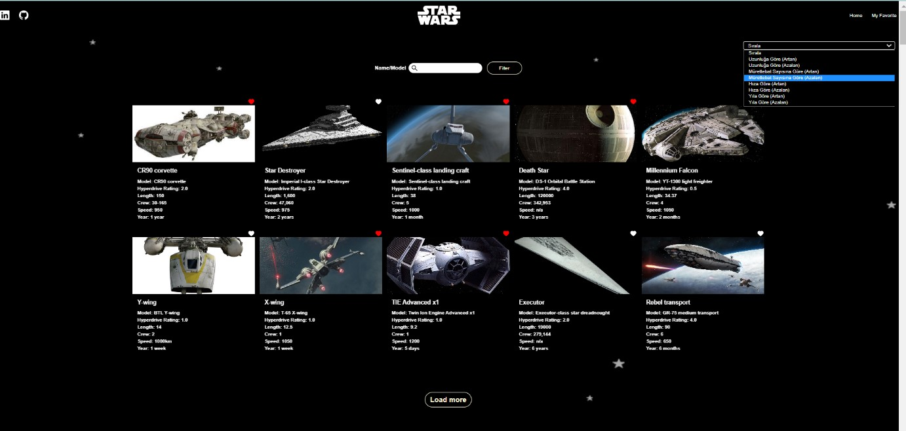
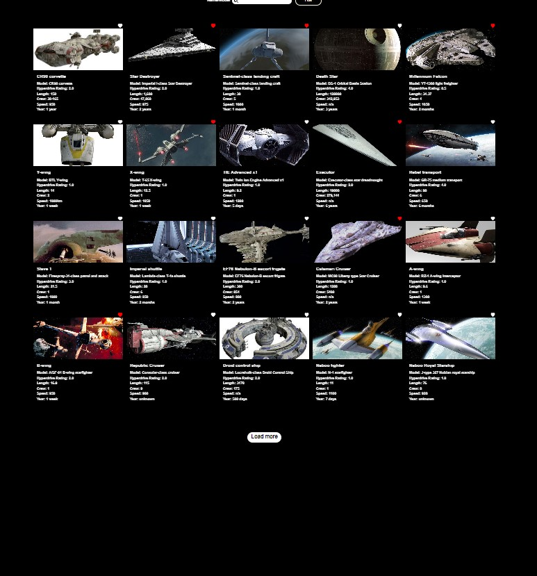
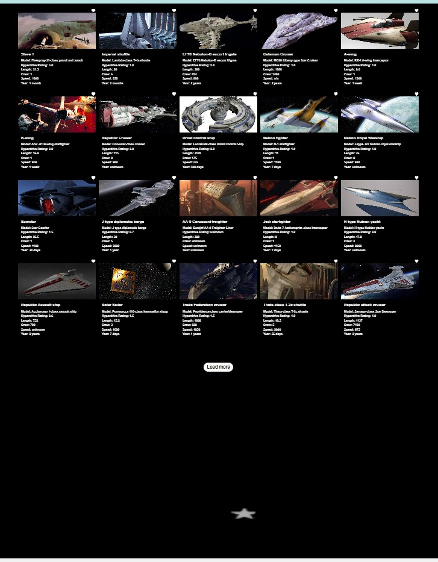
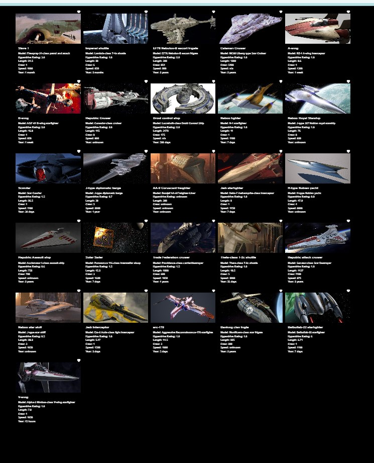
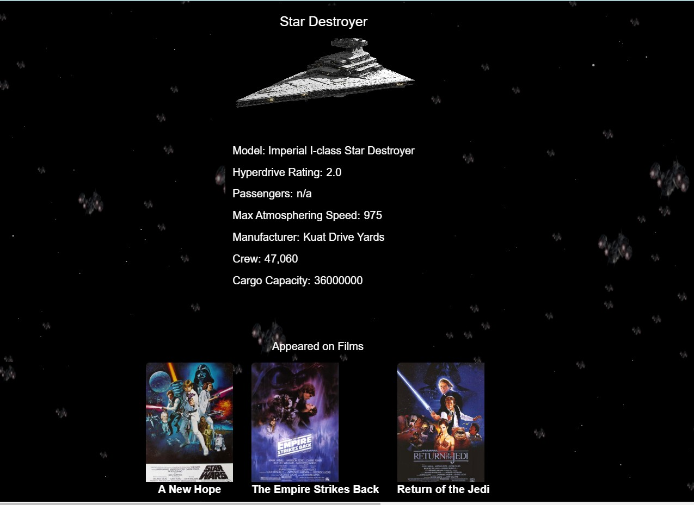
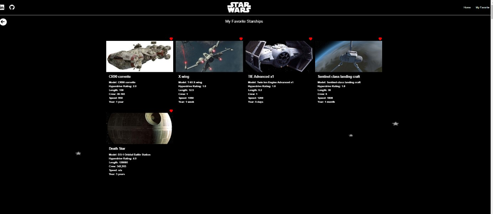

# Patika-Final-Case
FMSS Bilişim Front-end Practicum Final-Case

Features:

Listing starships (https://swapi.dev/)

Search among Starships

Read details of a specific starship

Load more starships with a load more button

# Getting Started with Create React App

This project was bootstrapped with [Create React App](https://github.com/facebook/create-react-app).

## Setup
npm install react-dom

npm install react-icons

npm install react-router-dom

npm install three

npm install axios 

npm install -D tailwindcss

npx tailwindcss init

### `npm start`

Runs the app in the development mode.\
Open [http://localhost:3000](http://localhost:3000) to view it in your browser.

 
# Technologies and Libraries:

React.js,
Context,
React Router,
Axios,
React Icons,
Tailwind CSS,
ThreeJS,

## Screenshot

Home Page

Starship Detail Page

My Favorite Starshıps Page

